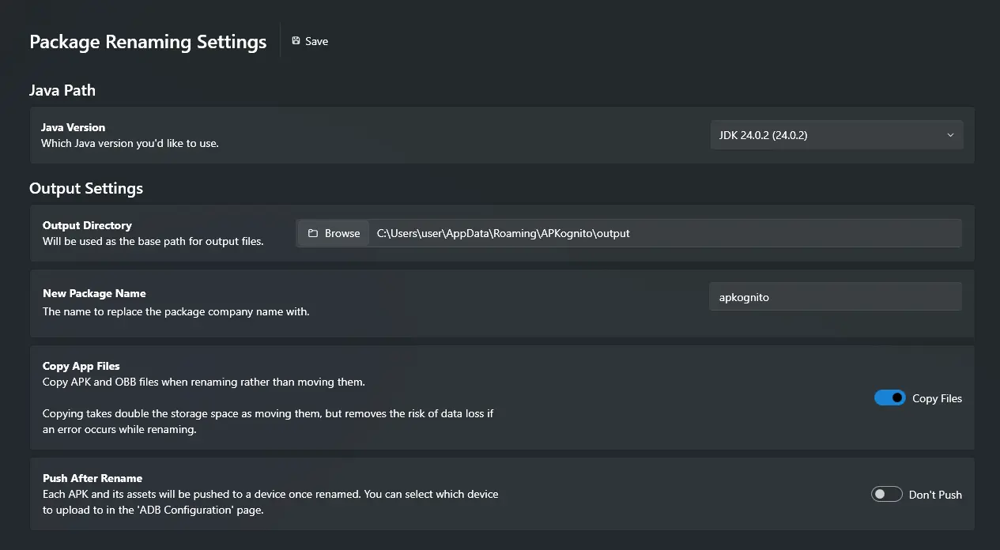

# Configurations

<!-- md:meta config | rename-settings.json -->

APKognito offers both basic and advanced configurations. All basic configurations can be at the top of the Rename Settings page.

There a several basic options that come build into a dropdown card menu on the main package renamer page.

## Java Path

### Java Version

<!-- md:flag required -->
<!-- md:meta text | java_version -->

Allows you to select which JDK or JRE version to use.

## Output Settings

### Output Directory

<!-- md:meta path | apk_output -->

This is the directory that all renamed packages are placed into.

The default path is `%APPDATA%\APKognito\output`.

### New Package Name

<!-- md:meta text | apk_replacement_name -->

This is the replacement company name of a package.

!!! example

    apk_replacement_name = `apkognito`

    `com.sombody101.myapp` -> `com.apkognito.myapp`

The default value for this is `apkognito`.

### Copy App Files

<!-- md:meta toggle | copy_when_renaming -->

This option is only useful if there isn't enough space on which ever drive `%TEMP%` is defined on (usually the C drive `%APPDATA%\Temp\`). Disabling this toggle will _move/delete_ the source app files immediately after their use, but before the process is finished. This is to preserve drive space.

!!! warning

    APKognito will not reverse the process if the renaming process fails while this is set to move files. You'll have to rebuild your project and get the original app again. A warning dialog will appear when this option is toggled.

### Push After Rename

<!-- md:meta toggle | push_after_rename -->

Each renamed package will be pushed to an ADB enabled device after being renamed. This toggle requires that platform tools is installed and a valid path is set in APKognito. You can also enter the command `:install-adb` in the Console Page to install and configure platform tools automatically.

### Open Advanced Options

<!-- md:meta page -->

To learn more about the Advanced Configurations APKognito has to offer, go to the [Advanced configuration](advanced/advanced_package_configurations.md) guide.
