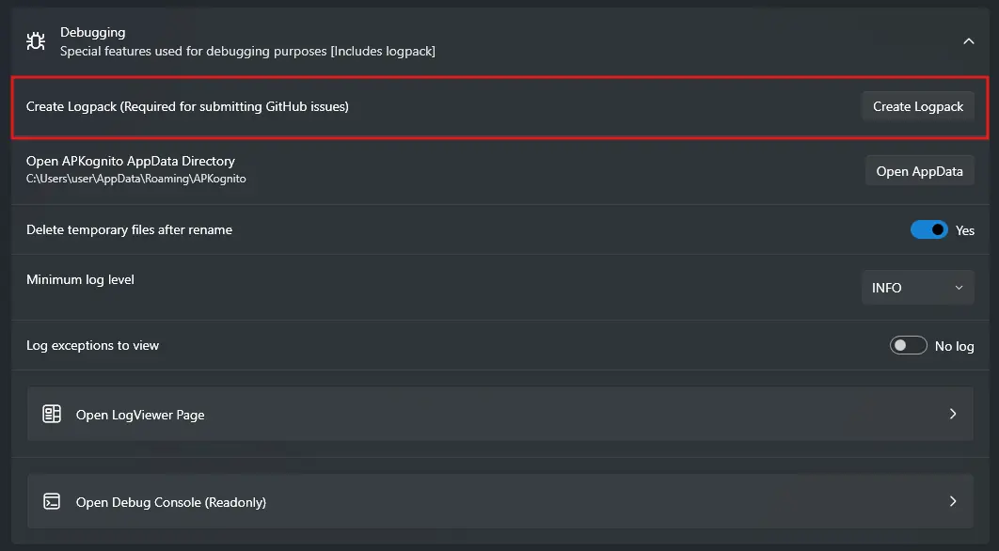

## What is a logpack?

A logpack is a ZIP archive that contains information, logs, and certain configurations about your APKognito installation that can help with debugging.

The items in a logpack include:

-   App logs.
-   Exception logs.
-   Package Renaming history.
-   All text found within the Package Renamer page log box.
-   An empty file that's given the APKognito version as a name. (e.g., `v2.0.0.0`)

!!! warning
    Please do _not_ copy/paste text from any log boxes inside APKognito unless _asked_ by an active maintainer of APKognito. All information found in those boxes can already be found in the logpack with the key difference being that your username is redacted.

## How to create a logpack

To create a logpack, navigate to the settings menu at the bottom left of the APKognito window, then select the `Debugging` dropdown. Under it you should see a button that says `Create Logpack`.

All needed information will then be written to a ZIP archive. If it's created successfully, a dialog menu will appear asking if you'd like to open Explorer in the same directory as the logpack, then click `Open`. Otherwise, click `Close` and the dialog will disappear.

!!! note
    A logpack is required to submit a bug report or issue on both GitHub and Discord. A link will be given to this Wiki article explaining how to do so.
