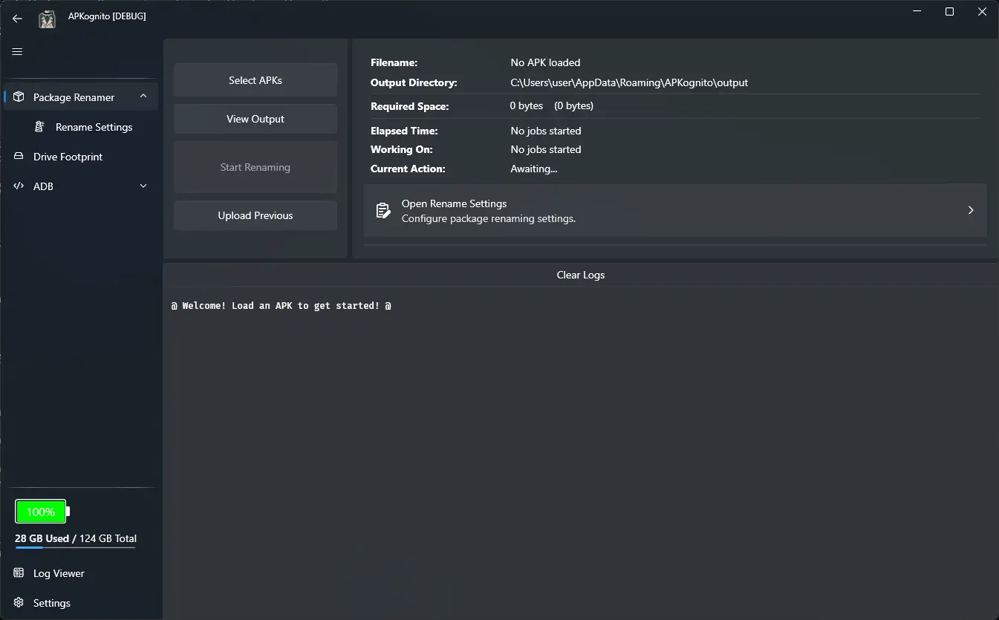
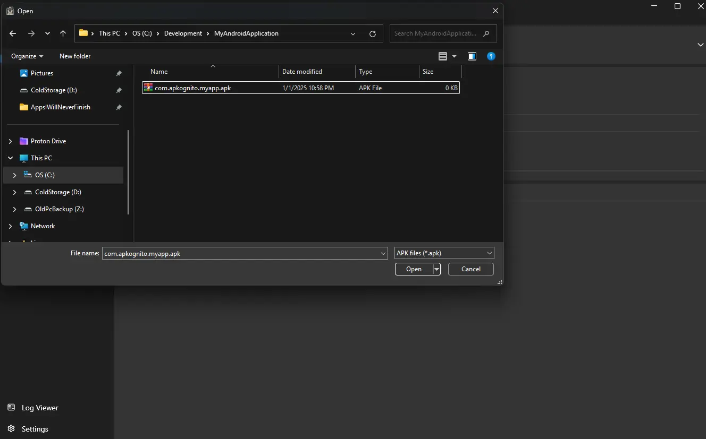
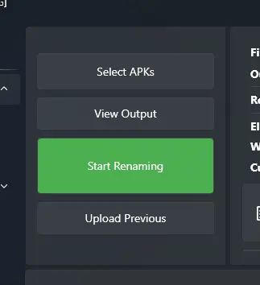

# Getting Started with APKognito

If you haven't already, please make sure to download and install APKognito. You can find a quick guide in [Installing APKognito](./installing.md).

---

### Step 1: Navigating Windows SmartScreen

When you first run APKognito, Windows will likely display a security warning. This is called [Windows SmartScreen](https://learn.microsoft.com/en-us/windows/security/operating-system-security/virus-and-threat-protection/microsoft-defender-smartscreen/).

!!! tip "About SmartScreen"

    SmartScreen is a common warning for new **Free and Open-Source Software (FOSS)**. If you don't trust the app, it's always best to follow your gut and **do not run it**. Your security is important!

    I make sure to attach a link to Virus Total with every release, so you can use that to assist your judgement.

<figure markdown>
  
  <figcaption>The Windows SmartScreen warning.</figcaption>
</figure>

After clicking `More info` and `Run anyway`, APKognito will launch...

!!! bug "Just kidding!"

    <h3 style="text-align: center;">I HAVE HACKEKD YOUR PC 👻!</h3>
    
...I'm kidding. (sorry)

You should see a window that looks like this:

<figure markdown>
  
  <figcaption>The APKognito main window.</figcaption>
</figure>

---

### Step 2: Selecting Your Packages

To start, click the **`Select APKs`** button. This will open a File Explorer window. Navigate to and select the packages you want to rename.

<figure markdown>
  
  <figcaption>A totally real example of selecting packages in File Explorer.</figcaption>
</figure>

!!! tip "Batch Processing"

    APKognito is able to rename more than one package at once. You can select multiple files to process them in a batch.

---

### Step 3: Configuring and Starting the Process

At this point, you can adjust any [configurations](../configurations.md) to your liking, or simply proceed with the defaults.

By default, your output package name will be `{prefix}.apkognito.{app name}`.

Now, you're ready to start the renaming process. Click the **`Start Renaming`** button.

!!! tip

    Click the _big green button_ that says "Start Renaming" to start the renaming process.

    - A Frustrated Developer

---

### Step 4: Viewing the Output

All renamed packages are saved to the configured output directory, which defaults to `%APPDATA%\APKognito\output`.

Clicking the **`View Output`** button will open File Explorer directly to this location.

---

### Conclusion

Congratulations! You have successfully used APKognito to rename your first package.

-   To learn more, use the navigation menu on the left to explore other articles.
-   Ready for more? Dive into advanced topics like [advanced configuration](../advanced/advanced_package_configurations.md).
