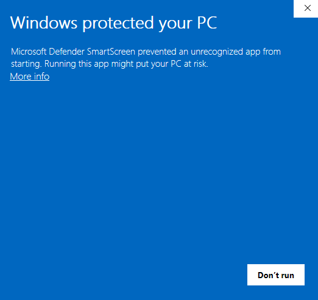
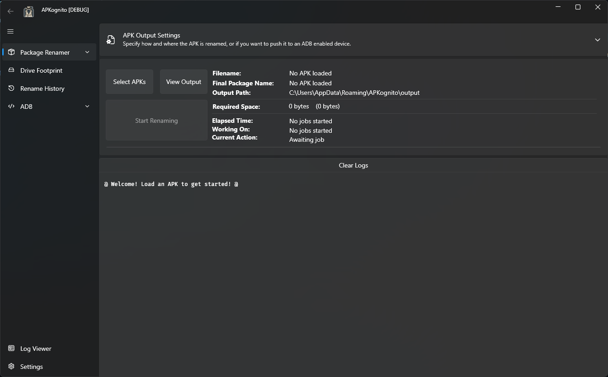
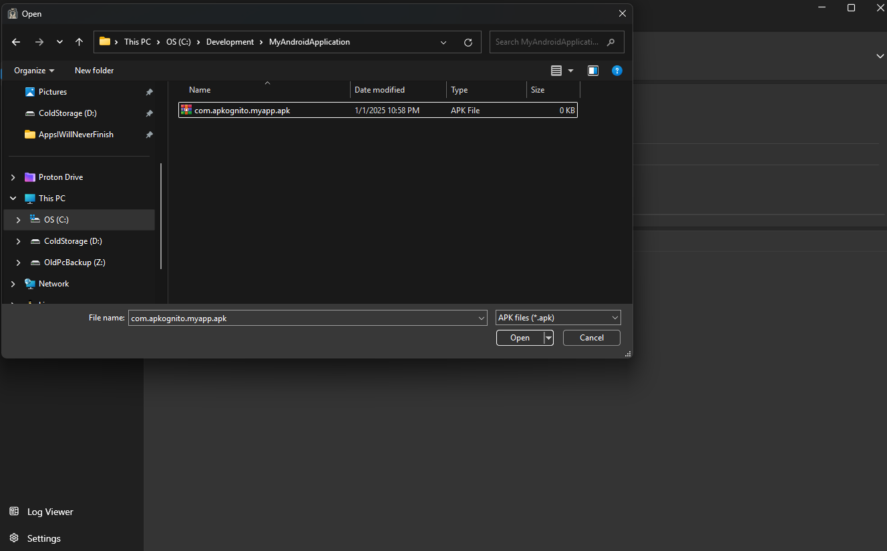
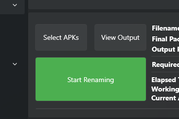

If you haven't, make sure to download APKognito. You can find a quick guide in [Installing APKognito](./installing.md).

When you first open APKognito, Windows will likely give you a warning that looks a lot like this:

This is called [Windows SmartScreen](https://learn.microsoft.com/en-us/windows/security/operating-system-security/virus-and-threat-protection/microsoft-defender-smartscreen/) and can be daunting
if you're new to Free and Open-Source Software (FOSS). So, if you don't trust APKognito, _then do not run it_.
It's better to trust your gut rather than gamble with software from the internet.

If you clicked the underlined text that says `More info` close to the top, then `Run anyway`...

Then MUAH HA HA HA, I HAVE HACKEKD YOUR PC 👻!!

I'm kidding (sorry). APKognito will launch and you should be presented with a window that looks like this (I'm running a Debug build since, ya know, I'm developing it, but you will still be presented with
something similar).

## Renaming your first package

To rename a package, you need to load some into APKognito. To do that, click `Select APKs`. This will open a File Explorer window.
Once open, navigate to your package.

!!! tip

    You may have noticed that the button you clicked said "APKs", that's because APKognito is able to rename more than one
    package in a batch.

At this point, you should have all basic (or advanced) configurations set to your liking. Or, if you'd like the basic experience, proceed with the defaults.
Your output package name will be `{prefix}.apkognito.{app name}` if you don't change anything. (e.g., `com.cooolsvile.thelorax` -> `com.apkognito.thelorax`).

Now, you're ready to start the renaming process.

!!! tip

    Click the *big green button* that says "Start Renaming" to start the renaming process.

    - A Frustrated Developer

All renamed packages will appear in the configured output directory, which defaults to `%APPDATA%\APKognito\output`.
Clicking `View Output` will open File Explorer to the output directory.

## Conclusion

That concludes the basic tutorial for using APKognito. Use the navigator to the left to look at more articles to understand other tools APKognito has to offer.
Or, if you're up to the challenge, check out the Advanced topics.
