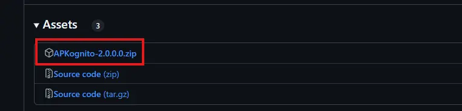
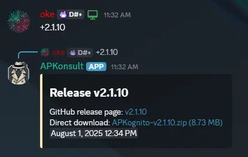

# Installing APKognito

### Download and Run

The latest version of APKognito is always available on our [GitHub Releases page](https://github.com/Sombody101/APKognito/releases/latest).

To install:

1.  Navigate to the latest release page.
2.  Download the ZIP file named `APKognito-{version}.zip`.
    <figure markdown>
      
      <figcaption>The ZIP file to download from the release assets.</figcaption>
    </figure>
3.  Extract the contents of the ZIP archive.
4.  Run the executable file inside.

Once the app is running, follow our [Getting Started](index.md) guide to learn how to use APKognito for the first time.

??? tip "Discord version command"

    You can get more information, as well as direct download links, by running the tag-command `+<version>` on the APKognito support Discord server.

    e.g., `+2.1.10`

    

---

### Understanding Version Types

APKognito uses specific prefixes to indicate the type of build you are using. This is important because **APKognito will only update to builds of the same type**.

| Prefix | Type | Description |
| :--- | :--- | :--- |
| `v` | **Public Release** | The standard, stable version. Updates are automatic and frequent.(e.g., `v2.0.0`) |
| `pd` | **Public Debug** | A build containing tools for diagnosing specific user issues. Theseare provided on a case-by-case basis and will eventually be rolled into a Public Release. |
| `d` | **Debug** | A local build only obtainable by compiling the source code yourself. Thesebuilds never receive updates since the version is constant, and full debug builds are neveruploaded. (e.g., `d1.0.0`) |

!!! warning "Important Note"

    If you are using a **Public Debug** build, you will not receive updates for **Public Release** versions, and vice versa. Your version type will only update to a newer build of the same type.

For more technical details on versioning, you can view the source file on GitHub: `AssemblyInfo.Version.cs`.

[:fontawesome-brands-github: View Current Version File](https://github.com/Sombody101/APKognito/blob/master/APKognito/AssemblyInfo.Version.cs){ .md-button .md-button--primary }
