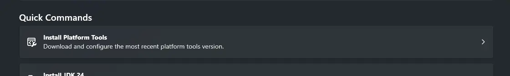
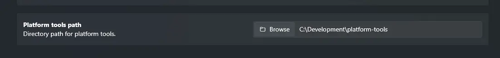

Configuring ADB (also known as Platform Tools) allows APKognito to interact with your connected ADB devices, including installing applications once renamed.
There are two main ways of doing so. **automatically (recommended)** via the ADB Configuration page's installer, or **manually** by entering the platform tools path in the ADB Configuration page.

## Automatically

Simply Navigate to the ADB Configuration page, and click the Install Platform Tools button.

## Manually

If you already know that you have platform tools installed and know where its directory lives, simply enter the path in the Platform Tools path textbox.

